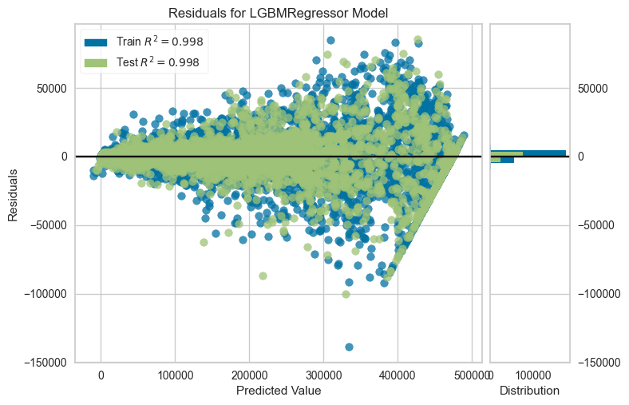

# 🎬 Trend-Eval: Predicting Content Success Using Hybrid ML + LLMs

Trend-Eval is a hybrid machine learning pipeline that blends **traditional regression modeling** with **LLM-based sentiment and reasoning evaluation** to predict YouTube content performance (e.g., views per day).

## 🧠 Project Overview

This repository is designed to evaluate the impact of audio-visual and textual features—extracted from trailers, metadata, and user comments—on content success. It also benchmarks LLM reasoning capabilities using evaluation suites like MMLU and HellaSwag.

## 🔍 Key Features

- 📈 Predictive regression pipeline using `PyCaret` + `LightGBM`
- 🧮 Auto feature selection, normalization, and model tuning
- 🧠 LLM evaluation via Hugging Face on:
  - `hellaswag`, `mmlu`, `lambada`, `arc_challenge`, `winogrande`, `piqa`
- 📊 Visualization of model diagnostics (residuals, error, feature importance)
- 🔍 Advanced charting (Seaborn, Matplotlib)
- 📂 CSV export of predictions and metrics
- 🔎 Integrated with **Zeno** for advanced LLM visualization and comparison

---


## 🧪 Training Pipeline

The core `train.py` file runs a full PyCaret-based regression training pipeline:

- Loads and validates data from `data/raw/*.json`
- Cleans and filters data for modeling
- Applies multicollinearity reduction, variance filtering
- Trains a `LightGBM` model with `tune_model()` using Bayesian optimization
- Saves predictions, residuals, charts, and model artifacts in `charts/`


## 📈 Model Diagnostics

This section presents key diagnostic plots generated after training the regression model. These help evaluate the model's performance, overfitting, and feature impact.

### Feature Importance


### Learning Curve


### Prediction Error


### Residuals


### Validation Curve


### 🗂 Output Files

- `charts/`: model diagnostic plots
- `charts/predictions.csv`: actual vs predicted
- `charts/metrics.csv`: performance metrics (R², RMSE, MAE)
- `model.pkl`: final model

---

## 🤖 LLM Benchmarking

The project also fine-tunes and evaluates lightweight LLMs on benchmark NLP tasks.

### 🔧 Models Used

```yaml
- nlptown/bert-base-multilingual-uncased-sentiment (max_length: 512)
- deepseek-ai/DeepSeek-R1-Distill-Qwen-1.5B (max_length: 2048)
- meta-llama/Llama-3.2-1B (max_length: 2048)
```
